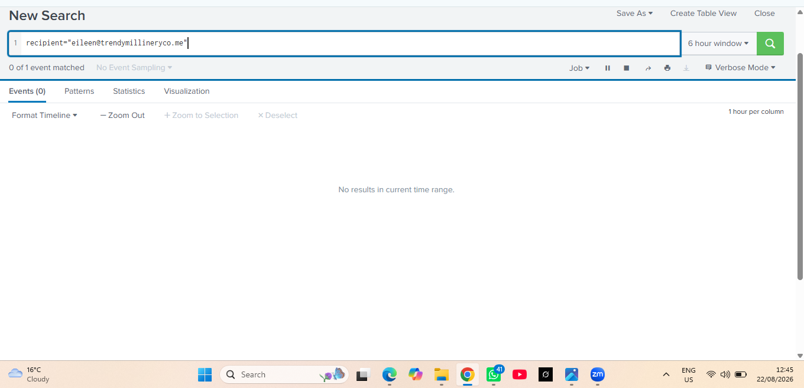
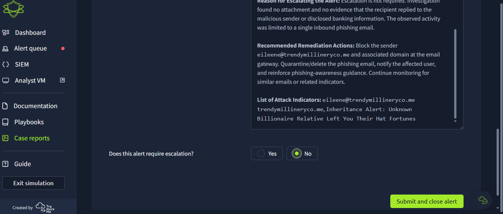

# Suspicious External Email / Inheritance Phishing

**Date:** 22 August 2026  
**Alert ID:** 1000  
**Category:** Phishing  
**Severity:** Low  
**Classification:** **True Positive**  
**Escalation:** **No**

## Incident Summary

An unsolicited inbound email from `eileen@trendymillineryco.me` used an inheritance-themed social-engineering pretext to solicit banking information from `support@tryhatme.com`. SIEM searches validated the suspicious message and were used to pivot on the sender and recipient. No attachment was present and the available evidence did not establish user interaction, disclosure of banking information or endpoint compromise.

The alert was therefore classified as a **True Positive phishing attempt**, with remediation documented but no escalation required based on the evidence available during the simulation.

## 5Ws Analysis

**Who:** External sender `eileen@trendymillineryco.me` targeted `support@tryhatme.com`.

**What:** A suspicious inheritance-themed email attempted to persuade the recipient to provide banking information.

**When:** Investigated during the SOC simulation on **22 August 2026**.

**Where:** The activity was observed in the simulated email/SIEM environment.

**Why:** The unsolicited inheritance claim and request for sensitive financial information were consistent with phishing and social-engineering behavior.

## Indicators / Suspicious Artifacts

- Sender: `eileen@trendymillineryco.me`
- Domain: `trendymillineryco.me`
- Inheritance-themed social-engineering pretext
- Request for banking information

## Analyst Decision

**Verdict: True Positive — No Escalation**

The message exhibited clear phishing characteristics. However, available evidence did not demonstrate that the recipient interacted with the message or that an endpoint/account compromise occurred. The appropriate response was therefore phishing remediation and monitoring without incident escalation.

## Recommended Remediation

- Quarantine or delete the phishing email.
- Block or monitor the suspicious sender/domain as appropriate.
- Search the email environment for related messages.
- Notify the targeted user and reinforce phishing-awareness guidance.
- Monitor for subsequent activity associated with the sender/domain.
- Escalate if later telemetry establishes credential disclosure, financial-data exposure or endpoint compromise.

## Evidence — Investigation Sequence

**1. Initial phishing alert** — Alert 1000 initiated the investigation.

**2. Subject-based SIEM search** — The message subject was used to validate matching email telemetry.

**3. Sender-based SIEM search** — The external sender was investigated for related activity.

**4. Recipient pivot / scope check** — Recipient-focused searching was used to determine whether additional related activity was present.

**5. Case report overview** — Findings were documented in the analyst case report.

**6. True Positive classification** — The phishing characteristics supported a confirmed True Positive verdict.

**7. Remediation and no-escalation decision** — Response actions were documented; escalation was not required because compromise was not established.

## Skills Demonstrated

- Phishing alert triage
- SIEM email-event searching
- Sender, subject and recipient pivots
- IOC identification
- 5Ws incident reporting
- True Positive classification
- Escalation reasoning
- Remediation planning
- Evidence-backed analyst documentation

> **Lab disclaimer:** This case documents work completed in a controlled TryHackMe SOC simulation. The identities, domains and telemetry shown are training evidence and do not represent a real production incident.
